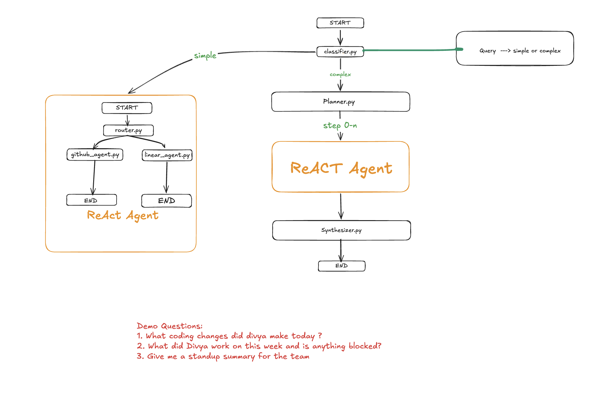

# Kitty - AI Engineering Team Assistant

An AI-powered engineering assistant that queries GitHub and Linear to provide real-time insights about your team's work. Ask natural language questions like _"What did Divya work on this week?"_ and get synthesized, cross-referenced answers.

## Architecture



### Query Flow

1. **Classifier** determines if a query is simple (single domain) or complex (cross-domain)
2. **Simple queries** route directly to a ReAct agent with domain-specific tools
3. **Complex queries** go through Plan-and-Execute:
   - **Planner** breaks the query into atomic steps using team identity resolution
   - **Executor** runs each step through the ReAct graph
   - **Synthesizer** cross-references GitHub + Linear data into a unified response

## Agents

| Agent            | Role                                              | Tools                                          |
| ---------------- | ------------------------------------------------- | ---------------------------------------------- |
| **Git Agent**    | GitHub specialist — commits, PRs, code changes    | `git_commits`, `git_pull_requests`             |
| **Linear Agent** | Linear specialist — issues, assignments, status   | `get_issues_by_assignee`, `get_issue_by_state` |
| **Planner**      | Decomposes complex queries into executable steps  | Structured output (no tools)                   |
| **Synthesizer**  | Cross-references results into actionable insights | LLM reasoning (no tools)                       |

## Features

- **Query Classification** — auto-detects simple vs complex queries
- **Identity Resolution** — resolves aliases across platforms (e.g., "mk" → GitHub: `mkswami01`, Linear: `Manoj Kumar`)
- **Cross-Referencing** — links commits to PRs to tickets (e.g., branch `feat/mk-26-*` → ticket MK-26)
- **Synthesized Output** — metrics, status indicators, action items, and anomaly detection

### Example Output

```
Query: "What was recently completed by mkumar? Does he have any tickets assigned?"

### Summary of Work Completed by Manoj Kumar

#### Recent Commits:
- Multiple commits on classifier feature, code reorganization, router cleanup

#### Completed Issues in Linear:
- ✓ MK-26: Build a classifier
- ✓ MK-24: Daily Briefs
- ✓ MK-8: Set up Linear workspace and API key

#### Cross-Reference:
- GitHub commit "Feat/mk-26-build-classifier" correlates with Linear ticket MK-26

#### Action Items:
- No outstanding tickets — assign new work
```

## Tech Stack

- **Python 3.14**
- **LangGraph** — stateful agent orchestration
- **LangChain + GPT-4o** — LLM reasoning and tool calling
- **GitHub REST API** — commits, pull requests, code changes
- **Linear GraphQL API** — issues, assignments, status tracking

## Project Structure

```
├── main.py                    # Entry point — REPL loop
├── graph/
│   ├── graph_initializer.py   # Classification graph (simple vs complex)
│   ├── react_graph.py         # ReAct agent for single-domain queries
│   └── plan_graph.py          # Plan-Execute-Synthesize for complex queries
├── agent/
│   ├── state.py               # State definitions (AgentState, PlannerState)
│   ├── router.py              # Domain routing (github vs linear)
│   ├── planner.py             # Query decomposition with identity resolution
│   ├── git_agent.py           # GitHub specialist agent
│   ├── linear_agent.py        # Linear specialist agent
│   └── briefs.py              # Daily brief agent
├── tools/
│   ├── github_tools.py        # GitHub API — commits, PRs, code changes
│   ├── linear_tools.py        # Linear GraphQL — issues, assignments
│   ├── git_tools.py           # Local git subprocess wrapper
│   └── briefs.py              # Daily brief data consolidation
├── router/
│   └── classifier.py          # Query complexity + domain classification
├── models/
│   └── classifier.py          # Pydantic schemas for classification
├── config/
│   └── team.py                # Team roster + identity resolution
└── skill.md                   # Development roadmap
```

## Setup

```bash
# Clone
git clone https://github.com/mkswami01/bravo.git
cd bravo

# Install dependencies
uv sync

# Configure environment
cp .env.example .env
# Add your API keys:
#   OPENAI_API_KEY=
#   GITHUB_API_FINE_GRAIN_ACCESS=
#   LINEAR_API_KEY=

# Run
uv run python main.py
```

## Sample Queries

```
# Simple (single domain)
"What did Divya commit yesterday?"
"Show me all open PRs"
"What tickets are in progress?"

# Complex (cross-domain, synthesized)
"What did Divya work on this week and is anything blocked?"
"What was recently completed by mkumar? Does he have any tickets assigned?"
"Give me a standup summary for the team"

# Demo questions:
1. What coding changes did divya make today ?
2. What did Divya work on this week and is anything blocked?
3. Give me a standup summary for the team
```
